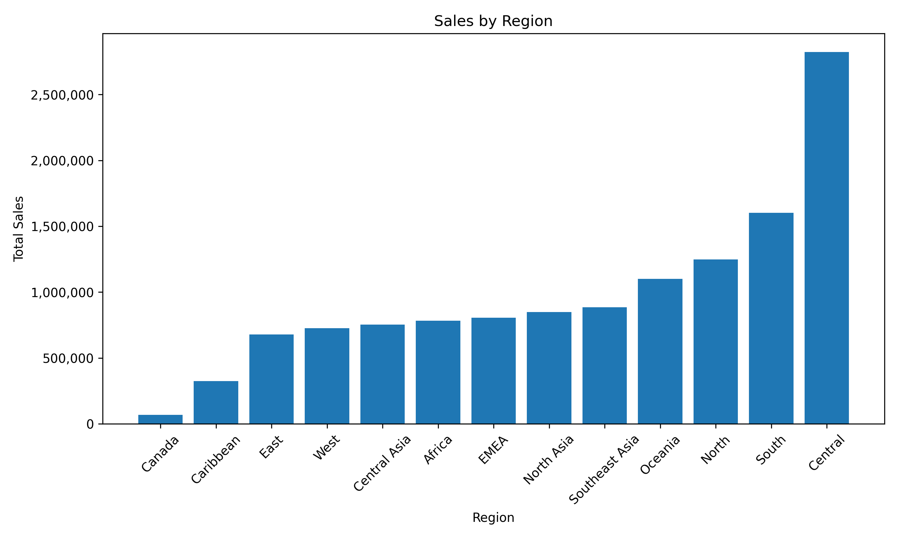
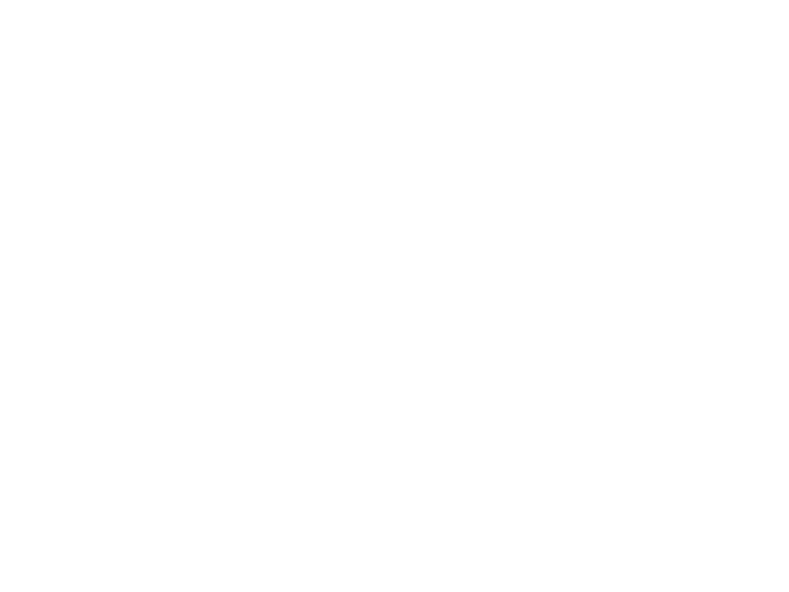
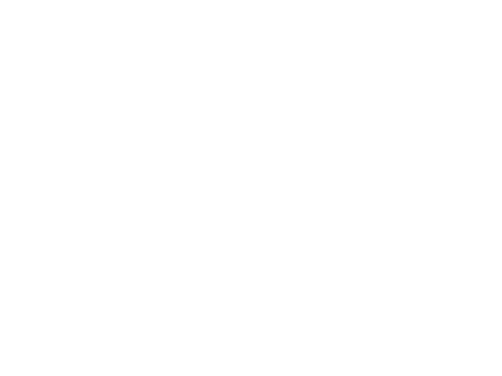
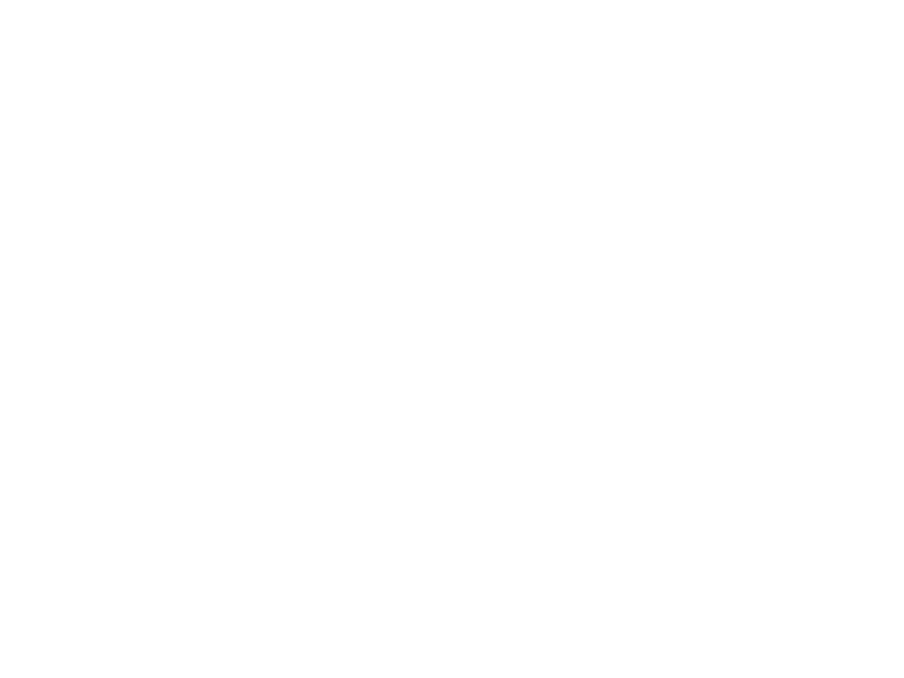
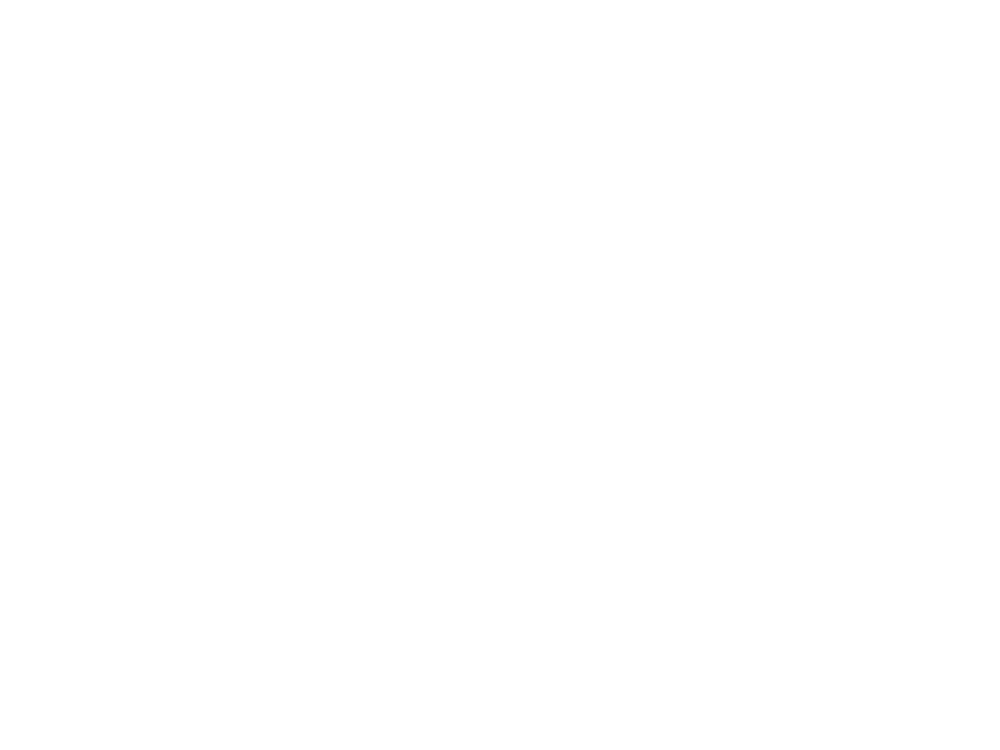
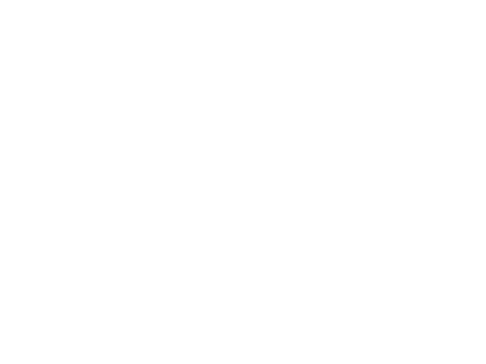
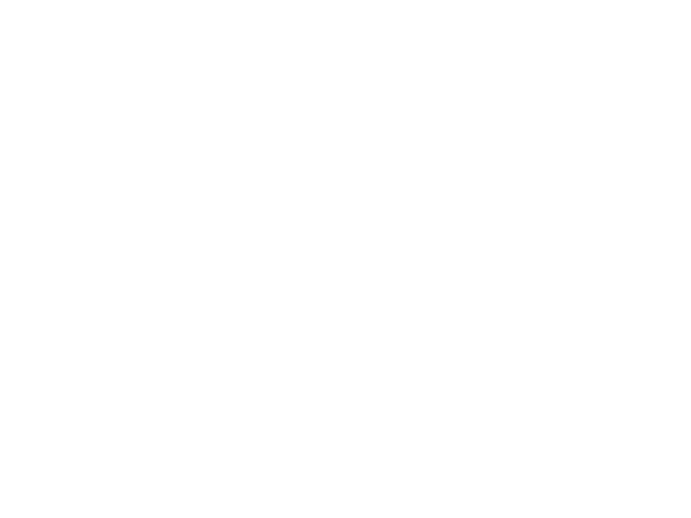
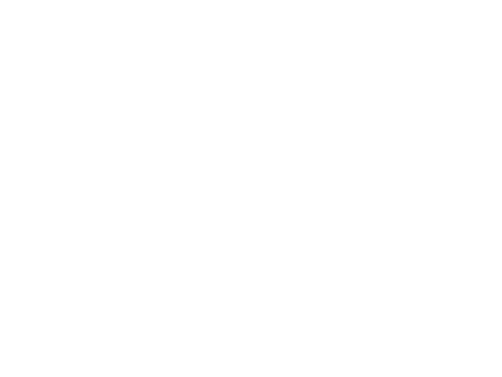

# 📊 Sales Analysis Dashboard

## 📌 Project Overview

This project analyzes SuperStore sales data using Python, Pandas, and Matplotlib to discover business insights and visualize sales performance.

---

## 🛠️ Technologies Used

- Python
- Pandas
- Matplotlib
- Jupyter Notebook

---

## 📂 Dataset

- SuperStore Orders Dataset
- 51,290 rows
- 21 columns

---

## 📊 Analysis Performed

- Data Cleaning
- Sales by Region
- Sales by Category
- Profit by Category
- Sales by Year
- Top 10 Customers
- Top 10 Products
- Sales by Shipping Mode
- Discount vs Profit Analysis

---

## 📈 Key Business Insights

- Sales increased consistently from 2011 to 2014.
- Technology generated the highest sales.
- Central region had the highest sales.
- Standard Class was the most used shipping mode.
- Higher discounts often reduced profit.
- Top customers contributed significantly to revenue.

---

## 📷 Dashboard Preview

### Sales by Region

### Sales by Category

### Profit by Category

### Sales by Year

### Top Customers

### Top Products

### Shipping Mode

### Discount vs Profit

---

## 🚀 Future Improvements

- Build an interactive Power BI dashboard
- Create an Excel dashboard
- Add forecasting using Machine Learning
- Deploy as a Streamlit web app

---

## 👩‍💻 Author

**Jujjuvarapu Jyothirlatha**

B.Tech Computer Science & Engineering

Data Analytics Enthusiast